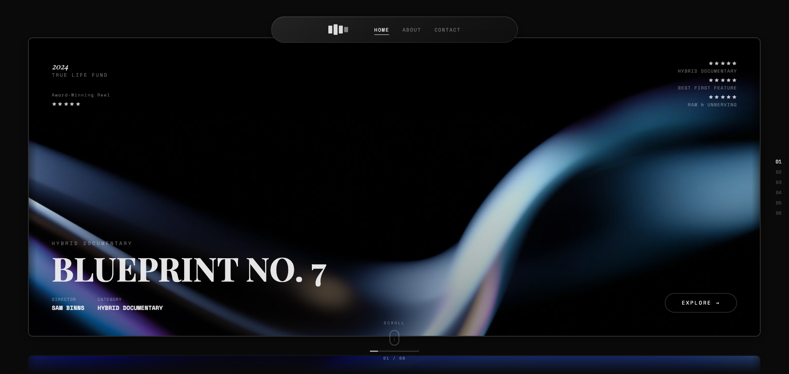

# Cinema Reel — Motion

A vertical film-portfolio slider with cinematic snap-physics.



## Features

- Glassmorphism navbar with blur effects
- Vertical film strip with snap-scroll physics
- Gradient overlays for depth
- Scroll progress indicator
- Navigation dots for quick access
- Smooth animations and transitions

## Technical Stack

- **HTML5** — Semantic markup
- **CSS3** — Custom properties, glassmorphism, gradients
- **JavaScript (Vanilla)** — Scroll physics, DOM manipulation
- **Fonts:** Playfair Display, Space Mono
- **Theme:** Dark mode

## Project Structure

```
cinema-reel/
├── index.html      # Main page
├── about.html    # About page
├── contact.html  # Contact page
├── css/
│   └── style.css
├── js/
│   └── main.js
├── images/
│   └── logo.svg
├── docs/
└── screenshot.png
```

## Usage

Simply open `index.html` in any modern browser. No build step required.

```bash
# Or serve locally
npx serve .
```

## License

MIT